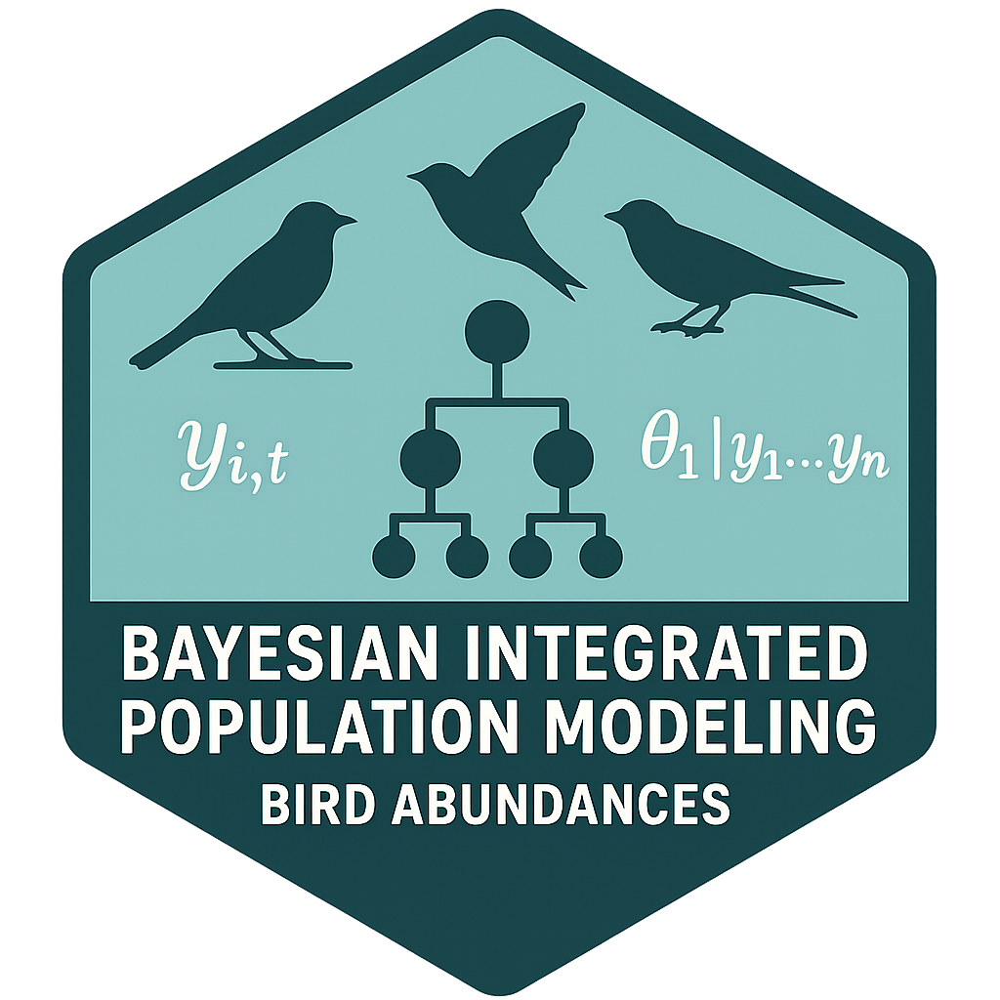

# Bayesian Integrated Population Models for Bird Abundances 

> A repository for predicting rangeshifts of birds using spatially explicit integrated dynamic N-mixture models
### Author: [J. Alex Baecher]([https://www.alexbaecher.com/](https://github.com/slamander/sw_bird_shifts))

# This repository contains code for...
  - Cleaning and processing data from eBird, BBS, and IMBCR
  - R-nimble code for Bayesian N-mixture models
    * Joint likelihoods (integrated)
    * Spatially explicit (low-rank Gaussian processes)
    * Temporally dynamic (Markov processes)

### Correspondance: please contact the first author, J. Alex Baecher, for questions about the code or data: 
  - e-mail: jbaecher@gmail.com
  - github: https://github.com/slamander
  - personal website: https://www.alexbaecher.com/
